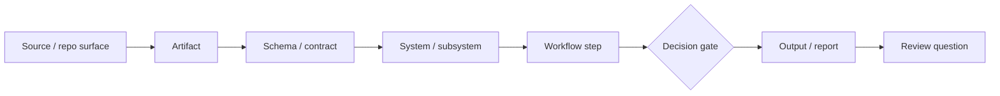
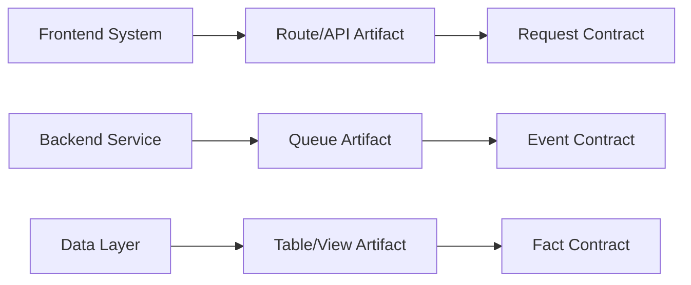
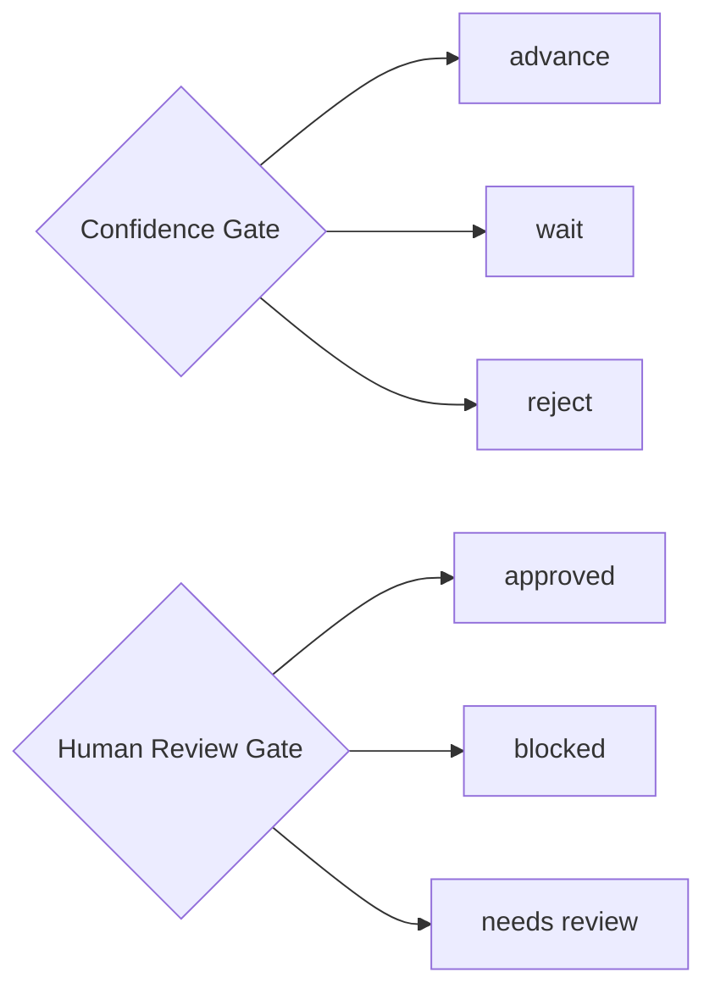
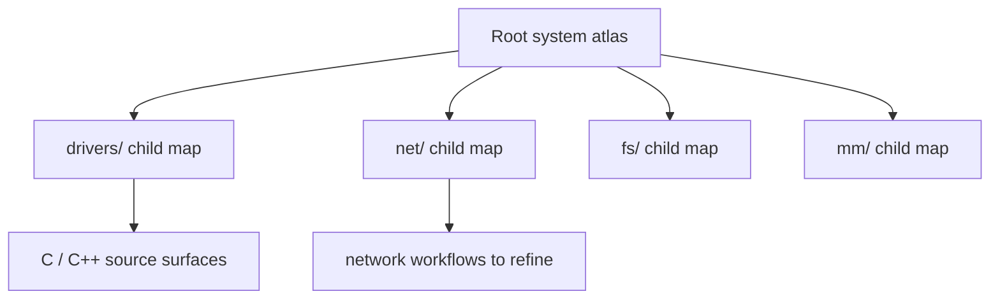

# System Review Graph

Generate system-level review graphs: what a repo actually does, not just what
code exists.

Code-review graphs tell you what code exists. System Review Graph tells you what the system actually does.

It turns a public or sanitized manifest into:

- a system-level graph,
- a reverse-engineering report,
- architecture and workflow maps,
- decision-gate documentation,
- schema and artifact references,
- walkthrough examples for reviewers, maintainers, and AI agents.
- optional HTML and Graphviz DOT outputs.
- optional map-of-maps atlases for huge repositories.
- an MCP server so agents can scan, build, validate, and load atlas context.

This project is meant for open-source maintainers, platform teams, audit teams, AI coding agents, and new engineers who need to understand a repo as an operating system rather than a pile of files.

## Why This Exists

Most repo maps stop at modules, classes, functions, imports, and calls. That is useful, but it does not answer the questions a real reviewer asks:

- What does this system do?
- What are the decision gates?
- What data or artifacts feed each stage?
- What actions can happen downstream?
- What is blocked by human/legal/security review?
- What can be shared publicly when the database is private?
- How could someone rebuild the system from the report?

System Review Graph is the opposite side of a code-review graph:

| Map | Answers |
|---|---|
| Code-review graph | What code exists and how it connects. |
| System Review Graph | What the system does, how it moves, what it trusts, and what it blocks. |

## How It Figures Out What A System Does

System Review Graph does **not** pretend that a call graph alone proves system
behavior.

The method is:

```text
sources -> artifacts -> schemas -> systems -> workflows -> gates -> outcomes -> review questions
```

Code shows what can happen. A system review asks what actually moves through
the system, what contracts shape it, what gates control it, what artifacts prove
it, and what the reviewer should inspect next.

The report is built from a manifest because many real systems cannot safely
publish raw databases, production data, credentials, model weights, or private
service internals. The manifest can be generated by humans, scripts, AI agents,
or future repo scanners.

Use code as evidence, but not the only evidence:

- source directories,
- function and module surfaces,
- CLI entry points,
- APIs and route files,
- schemas and migrations,
- configs,
- tests,
- docs,
- queues, reports, dashboards, and logs,
- human/legal/security gates.

Read more in [`docs/METHODOLOGY.md`](docs/METHODOLOGY.md).

## What It Looks Like

Lifecycle map:



Artifact and schema expansion:



Gate map:



Map of maps for huge repositories:



## Quick Start

```bash
python -m pip install -e .
system-review-graph list-examples
system-review-graph validate --manifest examples/fictional_ai_ops/system_review_manifest.json
system-review-graph doctor --manifest examples/fictional_ai_ops/system_review_manifest.json
system-review-graph build \
  --manifest examples/fictional_ai_ops/system_review_manifest.json \
  --out-dir examples/fictional_ai_ops/reports \
  --depth deep \
  --html \
  --dot
```

Open:

```text
examples/fictional_ai_ops/reports/system_review_graph.md
```

Try an actual public repo example:

```bash
system-review-graph build \
  --manifest examples/actual_repos/fastapi/system_review_manifest.json \
  --out-dir examples/actual_repos/fastapi/reports
```

Copy a bundled starter manifest:

```bash
system-review-graph init-example \
  --example actual_repos/duckdb \
  --out-dir /tmp/duckdb-system-review \
  --force
```

Generate a starter manifest from any local repo:

```bash
system-review-graph scan \
  --repo /path/to/repo \
  --out /tmp/system_review_manifest.json \
  --title "My Project System Review Graph"
```

The scanner supports mixed-language repositories. It detects starter surfaces
for C, C++, Java, C#, Python, JavaScript/TypeScript, Go, Rust, docs, tests, and
common build/config files. Scanner output is intentionally marked as inferred;
it is a starting map, not proof of runtime behavior.

For a huge repository, generate an atlas instead of one giant flat graph:

```bash
system-review-graph scan \
  --repo /path/to/large/repo \
  --atlas \
  --out /tmp/system-review-atlas \
  --max-subsystems 24 \
  --build-reports \
  --depth overview
```

That writes:

```text
/tmp/system-review-atlas/system_review_manifest.json
/tmp/system-review-atlas/reports/system_review_graph.md
/tmp/system-review-atlas/subsystems/*/system_review_manifest.json
```

The root manifest includes `child_maps`, so a reviewer or AI agent can load one
map and discover the linked subsystem maps.

Expose SRG to MCP-capable agents:

```bash
system-review-graph-mcp
```

Example MCP client entry:

```json
{
  "mcpServers": {
    "system-review-graph": {
      "command": "system-review-graph-mcp"
    }
  }
}
```

See [`docs/MCP.md`](docs/MCP.md).

## Example Gallery

| Example | What It Teaches | Generated Report |
|---|---|---|
| Fictional AI Ops | End-to-end `source -> fact -> decision -> action -> outcome -> lesson` flow | `examples/fictional_ai_ops/reports/system_review_graph.md` |
| FastAPI | Framework/API runtime mapping | `examples/actual_repos/fastapi/reports/system_review_graph.md` |
| DuckDB | Database/query-engine mapping | `examples/actual_repos/duckdb/reports/system_review_graph.md` |
| OpenTelemetry Collector | Component pipeline and API-only review mapping | `examples/actual_repos/opentelemetry_collector/reports/system_review_graph.md` |
| Linux Kernel Atlas | Large-repo map-of-maps stress test | `examples/actual_repos/linux_kernel/reports/system_review_graph.md` |

The actual-repo examples are educational public-review maps, not official
maintainer audits.

## Depth Levels

Reports are generated with `--depth deep` by default.

| Depth | Use When | Includes |
|---|---|---|
| `overview` | You need the fastest orientation. | Current truth, source links, lifecycle map, expansion index, systems, architecture patterns, walkthroughs, review questions. |
| `standard` | You want a normal audit handoff. | Overview plus artifact/schema map, gate map, system details, artifacts, schemas, gates, and workflows. |
| `deep` | You want blueprint-level inspection. | Standard plus relationship graph, schema examples, and per-system artifact/gate/workflow drill-downs. |

```bash
system-review-graph build \
  --manifest examples/actual_repos/duckdb/system_review_manifest.json \
  --out-dir /tmp/duckdb-system-review \
  --depth deep
```

## Manifest-First Design

The tool is intentionally manifest-first. A project can expose a safe system map without exposing private tables, production data, model weights, vendor contracts, or internal credentials.

That matters for:

- public open-source projects,
- enterprise services with private databases,
- data platforms,
- ML systems,
- agent systems,
- microservice platforms,
- embedded or hardware-adjacent systems,
- regulated or security-sensitive environments.

## What You Describe

A manifest describes:

- systems,
- artifacts,
- schemas,
- decision gates,
- workflows,
- graph edges,
- child maps for large-repo atlases,
- source links,
- current truth,
- architecture patterns,
- walkthroughs,
- review questions,
- rebuild recipe,
- known boundaries.

Example system row:

```json
{
  "system_id": "action_engine",
  "name": "Action Engine",
  "purpose": "Turns approved recommendations into bounded action intents.",
  "architecture_style": "event-driven service",
  "language_stack": ["Python", "PostgreSQL", "OpenAPI"],
  "truth_boundary": "Can propose actions, but cannot execute restricted actions without a human gate.",
  "ideal_target": "Every action has an outcome and lesson."
}
```

## Public-Safe Reviews

Companies often cannot publish database schemas, architecture details, or source data. This tool supports sanitized reporting:

- publish interface schemas instead of raw tables,
- publish field names without sample values,
- publish evidence counts instead of records,
- publish redacted artifact paths,
- publish decision rules without secrets,
- publish risk boundaries and human gates.

The goal is not to leak the system. The goal is to explain the system.

## Outputs

`build` always writes:

```text
system_review_graph.json
system_review_graph.md
```

Optional:

```bash
system-review-graph build --manifest system_review_manifest.json --out-dir reports --html
system-review-graph build --manifest system_review_manifest.json --out-dir reports --dot
```

Optional files:

```text
system_review_graph.html
system_review_graph.dot
```

`scan --atlas --build-reports` writes the same report files for the root atlas
and each child subsystem map.

## Repository Layout

```text
src/system_review_graph/
  builder.py      # manifest -> graph object
  render.py       # Markdown and Mermaid rendering
  cli.py          # system-review-graph CLI
  models.py       # typed graph structures
  example_manifests/
docs/
  METHODOLOGY.md
  WALKTHROUGH.md
  SCHEMA.md
  ARCHITECTURE_PATTERNS.md
  OPEN_SOURCE_LAUNCH.md
  PYPI_RELEASE.md
examples/
  fictional_ai_ops/
    system_review_manifest.json
    reports/system_review_graph.md
  actual_repos/
    fastapi/
    duckdb/
    opentelemetry_collector/
    linux_kernel/
```

## Project Docs

| Document | Purpose |
|---|---|
| [`docs/METHODOLOGY.md`](docs/METHODOLOGY.md) | Explains code map vs system map and the review methodology. |
| [`docs/WALKTHROUGH.md`](docs/WALKTHROUGH.md) | Step-by-step usage walkthrough. |
| [`docs/SCHEMA.md`](docs/SCHEMA.md) | Manifest fields and depth options. |
| [`docs/MCP.md`](docs/MCP.md) | MCP stdio server setup and tools. |
| [`docs/schema/system_review_manifest.schema.json`](docs/schema/system_review_manifest.schema.json) | JSON Schema for editor/tool validation. |
| [`docs/ARCHITECTURE_PATTERNS.md`](docs/ARCHITECTURE_PATTERNS.md) | How different system shapes map into the manifest. |
| [`docs/OPEN_SOURCE_LAUNCH.md`](docs/OPEN_SOURCE_LAUNCH.md) | How to make the repo findable and launch it publicly. |
| [`docs/PYPI_RELEASE.md`](docs/PYPI_RELEASE.md) | Build, verify, and publish package instructions. |
| [`ROADMAP.md`](ROADMAP.md) | Future work. |
| [`CHANGELOG.md`](CHANGELOG.md) | Release history. |

## Development

```bash
python -m pip install -e .
python -m pytest
python -m ruff check .
```

A GitHub Actions CI template is available at
`docs/ci/github-actions-ci.yml`. Copy it to `.github/workflows/ci.yml` in your
own repository if you want automated lint, tests, and example-report builds.
The template also shows how to regenerate an atlas on every push or pull
request so architecture drift becomes a visible merge artifact.

## Packaging

The project is configured as a Python package with the console command:

```bash
system-review-graph
system-review-graph-mcp
```

Build and check locally:

```bash
python -m pip install --upgrade build twine
python -m build
python -m twine check dist/*
```

See [`docs/PYPI_RELEASE.md`](docs/PYPI_RELEASE.md) before publishing.

## Discoverability

Suggested GitHub topics:

```text
architecture audit code-review documentation developer-tools mermaid reverse-engineering software-architecture system-design system-review
```

## Philosophy

Knowledge is not enough. A useful system map should show how knowledge becomes:

```text
source -> fact -> candidate -> decision -> action -> outcome -> lesson
```

That is the path from information to operational wisdom.
