# Linux Kernel System Review Atlas

Generated: `2026-06-08T20:21:48+00:00`
Scope: Generated from Linux kernel git tree paths at commit 2d3090a; source blobs were not copied.
One line: Map-of-maps generated for a large repository: root atlas links to subsystem manifests.
Depth: `overview`

## Bigger Picture

This is a large-repository map-of-maps stress test for System Review Graph. It uses real Linux kernel tracked paths to create a root atlas and child subsystem maps. The example is useful for orientation, CI drift checks, and reviewer routing, but it is not an official Linux maintainer audit and does not prove runtime behavior.

## Current Truth

- `file_limit_per_map`: `6000`
- `map_strategy`: `root atlas plus linked child subsystem manifests`
- `max_subsystems`: `24`
- `path_only_mirror`: `true`
- `root_files_seen`: `6000`
- `runtime_behavior_proven`: `false`
- `scanner`: `language_neutral_atlas`
- `source_blobs_copied`: `false`
- `source_commit`: `2d3090a8aeb596a26935db0955d46c9a5db5c6ce`
- `source_commit_date`: `2026-06-08 07:58:32 -0700`
- `source_commit_subject`: `Merge tag 'v7.1-p5' of git://git.kernel.org/pub/scm/linux/kernel/git/herbert/crypto-2.6`
- `source_repository`: `https://github.com/torvalds/linux`
- `subsystem_count`: `24`

## Source Links

| Source | Notes |
|---|---|
| [Linux kernel repository](https://github.com/torvalds/linux) | Public source repository used for the path-tree stress test. |
| [Linux kernel commit 2d3090a](https://github.com/torvalds/linux/commit/2d3090a8aeb596a26935db0955d46c9a5db5c6ce) | Merge tag 'v7.1-p5' of git://git.kernel.org/pub/scm/linux/kernel/git/herbert/crypto-2.6 |

## Map Of Maps

```mermaid
flowchart TD
  root["Linux Kernel System Review Atlas"]
  root --> child_arch["arch/ subsystem map\ninferred_from_source_tree"]
  child_arch --> child_arch_c_cpp["c_cpp"]
  root --> child_block["block/ subsystem map\ninferred_from_source_tree"]
  child_block --> child_block_c_cpp["c_cpp"]
  root --> child_certs["certs/ subsystem map\ninferred_from_source_tree"]
  child_certs --> child_certs_c_cpp["c_cpp"]
  root --> child_crypto["crypto/ subsystem map\ninferred_from_source_tree"]
  child_crypto --> child_crypto_c_cpp["c_cpp"]
  root --> child_documentation["Documentation/ subsystem map\ninferred_from_source_tree"]
  child_documentation --> child_documentation_python["python"]
  child_documentation --> child_documentation_c_cpp["c_cpp"]
  root --> child_drivers["drivers/ subsystem map\ninferred_from_source_tree"]
  child_drivers --> child_drivers_c_cpp["c_cpp"]
  child_drivers --> child_drivers_rust["rust"]
  root --> child_fs["fs/ subsystem map\ninferred_from_source_tree"]
  child_fs --> child_fs_c_cpp["c_cpp"]
  root --> child_include["include/ subsystem map\ninferred_from_source_tree"]
  child_include --> child_include_c_cpp["c_cpp"]
  root --> child_init["init/ subsystem map\ninferred_from_source_tree"]
  child_init --> child_init_c_cpp["c_cpp"]
  root --> child_io_uring["io_uring/ subsystem map\ninferred_from_source_tree"]
  child_io_uring --> child_io_uring_c_cpp["c_cpp"]
  root --> child_ipc["ipc/ subsystem map\ninferred_from_source_tree"]
  child_ipc --> child_ipc_c_cpp["c_cpp"]
  root --> child_kernel["kernel/ subsystem map\ninferred_from_source_tree"]
  child_kernel --> child_kernel_c_cpp["c_cpp"]
  root --> child_lib["lib/ subsystem map\ninferred_from_source_tree"]
  child_lib --> child_lib_c_cpp["c_cpp"]
  child_lib --> child_lib_rust["rust"]
  root --> child_mm["mm/ subsystem map\ninferred_from_source_tree"]
  child_mm --> child_mm_c_cpp["c_cpp"]
  child_mm --> child_mm_rust["rust"]
  root --> child_net["net/ subsystem map\ninferred_from_source_tree"]
  child_net --> child_net_c_cpp["c_cpp"]
  root --> child_rust["rust/ subsystem map\ninferred_from_source_tree"]
  child_rust --> child_rust_c_cpp["c_cpp"]
  child_rust --> child_rust_rust["rust"]
  root --> child_samples["samples/ subsystem map\ninferred_from_source_tree"]
  child_samples --> child_samples_c_cpp["c_cpp"]
  child_samples --> child_samples_rust["rust"]
  root --> child_scripts["scripts/ subsystem map\ninferred_from_source_tree"]
  child_scripts --> child_scripts_python["python"]
  child_scripts --> child_scripts_c_cpp["c_cpp"]
  child_scripts --> child_scripts_rust["rust"]
  root --> child_security["security/ subsystem map\ninferred_from_source_tree"]
  child_security --> child_security_c_cpp["c_cpp"]
  root --> child_sound["sound/ subsystem map\ninferred_from_source_tree"]
  child_sound --> child_sound_c_cpp["c_cpp"]
  root --> child_tools["tools/ subsystem map\ninferred_from_source_tree"]
  child_tools --> child_tools_python["python"]
  child_tools --> child_tools_c_cpp["c_cpp"]
  child_tools --> child_tools_rust["rust"]
  root --> child_usr["usr/ subsystem map\ninferred_from_source_tree"]
  child_usr --> child_usr_c_cpp["c_cpp"]
  root --> child_virt["virt/ subsystem map\ninferred_from_source_tree"]
  child_virt --> child_virt_c_cpp["c_cpp"]
  root --> child_licenses["LICENSES/ subsystem map\ninferred_from_source_tree"]
```



## Lifecycle Map


## Expansion Index

| Level | Use It To Answer | Report Section |
|---|---|---|
| 0. Situation | What is true now? | Current Truth |
| 0.5. Atlas | Which child map should I open next? | Map Of Maps |
| 1. Flow | How does the system move end to end? | Lifecycle Map |
| 2. Ownership | Which subsystem owns which artifact? | Artifact And Schema Map |
| 3. Control | Which rules advance, wait, or block? | Gate Map |
| 4. Implementation | Which files, APIs, docs, or outputs should I inspect? | System Details |
| 5. Audit | What should an external reviewer ask next? | Review Questions |

This is an overview report. Rebuild with `--depth standard` or `--depth deep` to expand artifacts, gates, schemas, workflows, and per-system drill-downs.

## Systems

| System | Owner | Stack | Architecture | Lifecycle | Boundary | Ideal Target |
|---|---|---|---|---|---|---|
| arch/ | unknown | C, C++ | top-level source-tree subsystem | open child map -> inspect source surfaces -> refine real workflows | Directory boundary is source-grounded; runtime responsibility and exact behavior require maintainer or deeper agent review. | Replace inferred directory node with exact subsystem workflows, APIs, contracts, risks, and tests. |
| block/ | unknown | C, C++ | top-level source-tree subsystem | open child map -> inspect source surfaces -> refine real workflows | Directory boundary is source-grounded; runtime responsibility and exact behavior require maintainer or deeper agent review. | Replace inferred directory node with exact subsystem workflows, APIs, contracts, risks, and tests. |
| certs/ | unknown | C, C++ | top-level source-tree subsystem | open child map -> inspect source surfaces -> refine real workflows | Directory boundary is source-grounded; runtime responsibility and exact behavior require maintainer or deeper agent review. | Replace inferred directory node with exact subsystem workflows, APIs, contracts, risks, and tests. |
| crypto/ | unknown | C, C++ | top-level source-tree subsystem | open child map -> inspect source surfaces -> refine real workflows | Directory boundary is source-grounded; runtime responsibility and exact behavior require maintainer or deeper agent review. | Replace inferred directory node with exact subsystem workflows, APIs, contracts, risks, and tests. |
| Documentation/ | unknown | C, C++, Python | top-level source-tree subsystem | open child map -> inspect source surfaces -> refine real workflows | Directory boundary is source-grounded; runtime responsibility and exact behavior require maintainer or deeper agent review. | Replace inferred directory node with exact subsystem workflows, APIs, contracts, risks, and tests. |
| drivers/ | unknown | C, C++, Rust | top-level source-tree subsystem | open child map -> inspect source surfaces -> refine real workflows | Directory boundary is source-grounded; runtime responsibility and exact behavior require maintainer or deeper agent review. | Replace inferred directory node with exact subsystem workflows, APIs, contracts, risks, and tests. |
| fs/ | unknown | C, C++ | top-level source-tree subsystem | open child map -> inspect source surfaces -> refine real workflows | Directory boundary is source-grounded; runtime responsibility and exact behavior require maintainer or deeper agent review. | Replace inferred directory node with exact subsystem workflows, APIs, contracts, risks, and tests. |
| include/ | unknown | C, C++ | top-level source-tree subsystem | open child map -> inspect source surfaces -> refine real workflows | Directory boundary is source-grounded; runtime responsibility and exact behavior require maintainer or deeper agent review. | Replace inferred directory node with exact subsystem workflows, APIs, contracts, risks, and tests. |
| init/ | unknown | C, C++ | top-level source-tree subsystem | open child map -> inspect source surfaces -> refine real workflows | Directory boundary is source-grounded; runtime responsibility and exact behavior require maintainer or deeper agent review. | Replace inferred directory node with exact subsystem workflows, APIs, contracts, risks, and tests. |
| io_uring/ | unknown | C, C++ | top-level source-tree subsystem | open child map -> inspect source surfaces -> refine real workflows | Directory boundary is source-grounded; runtime responsibility and exact behavior require maintainer or deeper agent review. | Replace inferred directory node with exact subsystem workflows, APIs, contracts, risks, and tests. |
| ipc/ | unknown | C, C++ | top-level source-tree subsystem | open child map -> inspect source surfaces -> refine real workflows | Directory boundary is source-grounded; runtime responsibility and exact behavior require maintainer or deeper agent review. | Replace inferred directory node with exact subsystem workflows, APIs, contracts, risks, and tests. |
| kernel/ | unknown | C, C++ | top-level source-tree subsystem | open child map -> inspect source surfaces -> refine real workflows | Directory boundary is source-grounded; runtime responsibility and exact behavior require maintainer or deeper agent review. | Replace inferred directory node with exact subsystem workflows, APIs, contracts, risks, and tests. |
| lib/ | unknown | C, C++, Rust | top-level source-tree subsystem | open child map -> inspect source surfaces -> refine real workflows | Directory boundary is source-grounded; runtime responsibility and exact behavior require maintainer or deeper agent review. | Replace inferred directory node with exact subsystem workflows, APIs, contracts, risks, and tests. |
| mm/ | unknown | C, C++, Rust | top-level source-tree subsystem | open child map -> inspect source surfaces -> refine real workflows | Directory boundary is source-grounded; runtime responsibility and exact behavior require maintainer or deeper agent review. | Replace inferred directory node with exact subsystem workflows, APIs, contracts, risks, and tests. |
| net/ | unknown | C, C++ | top-level source-tree subsystem | open child map -> inspect source surfaces -> refine real workflows | Directory boundary is source-grounded; runtime responsibility and exact behavior require maintainer or deeper agent review. | Replace inferred directory node with exact subsystem workflows, APIs, contracts, risks, and tests. |
| rust/ | unknown | C, C++, Rust | top-level source-tree subsystem | open child map -> inspect source surfaces -> refine real workflows | Directory boundary is source-grounded; runtime responsibility and exact behavior require maintainer or deeper agent review. | Replace inferred directory node with exact subsystem workflows, APIs, contracts, risks, and tests. |
| samples/ | unknown | C, C++, Rust | top-level source-tree subsystem | open child map -> inspect source surfaces -> refine real workflows | Directory boundary is source-grounded; runtime responsibility and exact behavior require maintainer or deeper agent review. | Replace inferred directory node with exact subsystem workflows, APIs, contracts, risks, and tests. |
| scripts/ | unknown | C, C++, Python, Rust | top-level source-tree subsystem | open child map -> inspect source surfaces -> refine real workflows | Directory boundary is source-grounded; runtime responsibility and exact behavior require maintainer or deeper agent review. | Replace inferred directory node with exact subsystem workflows, APIs, contracts, risks, and tests. |
| security/ | unknown | C, C++ | top-level source-tree subsystem | open child map -> inspect source surfaces -> refine real workflows | Directory boundary is source-grounded; runtime responsibility and exact behavior require maintainer or deeper agent review. | Replace inferred directory node with exact subsystem workflows, APIs, contracts, risks, and tests. |
| sound/ | unknown | C, C++ | top-level source-tree subsystem | open child map -> inspect source surfaces -> refine real workflows | Directory boundary is source-grounded; runtime responsibility and exact behavior require maintainer or deeper agent review. | Replace inferred directory node with exact subsystem workflows, APIs, contracts, risks, and tests. |
| tools/ | unknown | C, C++, Python, Rust | top-level source-tree subsystem | open child map -> inspect source surfaces -> refine real workflows | Directory boundary is source-grounded; runtime responsibility and exact behavior require maintainer or deeper agent review. | Replace inferred directory node with exact subsystem workflows, APIs, contracts, risks, and tests. |
| usr/ | unknown | C, C++ | top-level source-tree subsystem | open child map -> inspect source surfaces -> refine real workflows | Directory boundary is source-grounded; runtime responsibility and exact behavior require maintainer or deeper agent review. | Replace inferred directory node with exact subsystem workflows, APIs, contracts, risks, and tests. |
| virt/ | unknown | C, C++ | top-level source-tree subsystem | open child map -> inspect source surfaces -> refine real workflows | Directory boundary is source-grounded; runtime responsibility and exact behavior require maintainer or deeper agent review. | Replace inferred directory node with exact subsystem workflows, APIs, contracts, risks, and tests. |
| LICENSES/ | unknown |  | top-level source-tree subsystem | open child map -> inspect source surfaces -> refine real workflows | Directory boundary is source-grounded; runtime responsibility and exact behavior require maintainer or deeper agent review. | Replace inferred directory node with exact subsystem workflows, APIs, contracts, risks, and tests. |

## Child Maps

| Map | Manifest | Status | Scope | Systems | Review Hint |
|---|---|---|---|---|---|
| [arch/ subsystem map](../subsystems/arch/reports/system_review_graph.md) | [manifest](../subsystems/arch/system_review_manifest.json) | inferred_from_source_tree | arch | c_cpp | Open subsystems/arch/system_review_manifest.json first, then inspect real Linux source/docs/tests for the workflows and gates this inferred child map cannot prove. |
| [block/ subsystem map](../subsystems/block/reports/system_review_graph.md) | [manifest](../subsystems/block/system_review_manifest.json) | inferred_from_source_tree | block | c_cpp | Open subsystems/block/system_review_manifest.json first, then inspect real Linux source/docs/tests for the workflows and gates this inferred child map cannot prove. |
| [certs/ subsystem map](../subsystems/certs/reports/system_review_graph.md) | [manifest](../subsystems/certs/system_review_manifest.json) | inferred_from_source_tree | certs | c_cpp | Open subsystems/certs/system_review_manifest.json first, then inspect real Linux source/docs/tests for the workflows and gates this inferred child map cannot prove. |
| [crypto/ subsystem map](../subsystems/crypto/reports/system_review_graph.md) | [manifest](../subsystems/crypto/system_review_manifest.json) | inferred_from_source_tree | crypto | c_cpp | Open subsystems/crypto/system_review_manifest.json first, then inspect real Linux source/docs/tests for the workflows and gates this inferred child map cannot prove. |
| [Documentation/ subsystem map](../subsystems/documentation/reports/system_review_graph.md) | [manifest](../subsystems/documentation/system_review_manifest.json) | inferred_from_source_tree | Documentation | python, c_cpp | Open subsystems/documentation/system_review_manifest.json first, then inspect real Linux source/docs/tests for the workflows and gates this inferred child map cannot prove. |
| [drivers/ subsystem map](../subsystems/drivers/reports/system_review_graph.md) | [manifest](../subsystems/drivers/system_review_manifest.json) | inferred_from_source_tree | drivers | c_cpp, rust | Open subsystems/drivers/system_review_manifest.json first, then inspect real Linux source/docs/tests for the workflows and gates this inferred child map cannot prove. |
| [fs/ subsystem map](../subsystems/fs/reports/system_review_graph.md) | [manifest](../subsystems/fs/system_review_manifest.json) | inferred_from_source_tree | fs | c_cpp | Open subsystems/fs/system_review_manifest.json first, then inspect real Linux source/docs/tests for the workflows and gates this inferred child map cannot prove. |
| [include/ subsystem map](../subsystems/include/reports/system_review_graph.md) | [manifest](../subsystems/include/system_review_manifest.json) | inferred_from_source_tree | include | c_cpp | Open subsystems/include/system_review_manifest.json first, then inspect real Linux source/docs/tests for the workflows and gates this inferred child map cannot prove. |
| [init/ subsystem map](../subsystems/init/reports/system_review_graph.md) | [manifest](../subsystems/init/system_review_manifest.json) | inferred_from_source_tree | init | c_cpp | Open subsystems/init/system_review_manifest.json first, then inspect real Linux source/docs/tests for the workflows and gates this inferred child map cannot prove. |
| [io_uring/ subsystem map](../subsystems/io_uring/reports/system_review_graph.md) | [manifest](../subsystems/io_uring/system_review_manifest.json) | inferred_from_source_tree | io_uring | c_cpp | Open subsystems/io_uring/system_review_manifest.json first, then inspect real Linux source/docs/tests for the workflows and gates this inferred child map cannot prove. |
| [ipc/ subsystem map](../subsystems/ipc/reports/system_review_graph.md) | [manifest](../subsystems/ipc/system_review_manifest.json) | inferred_from_source_tree | ipc | c_cpp | Open subsystems/ipc/system_review_manifest.json first, then inspect real Linux source/docs/tests for the workflows and gates this inferred child map cannot prove. |
| [kernel/ subsystem map](../subsystems/kernel/reports/system_review_graph.md) | [manifest](../subsystems/kernel/system_review_manifest.json) | inferred_from_source_tree | kernel | c_cpp | Open subsystems/kernel/system_review_manifest.json first, then inspect real Linux source/docs/tests for the workflows and gates this inferred child map cannot prove. |
| [lib/ subsystem map](../subsystems/lib/reports/system_review_graph.md) | [manifest](../subsystems/lib/system_review_manifest.json) | inferred_from_source_tree | lib | c_cpp, rust | Open subsystems/lib/system_review_manifest.json first, then inspect real Linux source/docs/tests for the workflows and gates this inferred child map cannot prove. |
| [mm/ subsystem map](../subsystems/mm/reports/system_review_graph.md) | [manifest](../subsystems/mm/system_review_manifest.json) | inferred_from_source_tree | mm | c_cpp, rust | Open subsystems/mm/system_review_manifest.json first, then inspect real Linux source/docs/tests for the workflows and gates this inferred child map cannot prove. |
| [net/ subsystem map](../subsystems/net/reports/system_review_graph.md) | [manifest](../subsystems/net/system_review_manifest.json) | inferred_from_source_tree | net | c_cpp | Open subsystems/net/system_review_manifest.json first, then inspect real Linux source/docs/tests for the workflows and gates this inferred child map cannot prove. |
| [rust/ subsystem map](../subsystems/rust/reports/system_review_graph.md) | [manifest](../subsystems/rust/system_review_manifest.json) | inferred_from_source_tree | rust | c_cpp, rust | Open subsystems/rust/system_review_manifest.json first, then inspect real Linux source/docs/tests for the workflows and gates this inferred child map cannot prove. |
| [samples/ subsystem map](../subsystems/samples/reports/system_review_graph.md) | [manifest](../subsystems/samples/system_review_manifest.json) | inferred_from_source_tree | samples | c_cpp, rust | Open subsystems/samples/system_review_manifest.json first, then inspect real Linux source/docs/tests for the workflows and gates this inferred child map cannot prove. |
| [scripts/ subsystem map](../subsystems/scripts/reports/system_review_graph.md) | [manifest](../subsystems/scripts/system_review_manifest.json) | inferred_from_source_tree | scripts | python, c_cpp, rust | Open subsystems/scripts/system_review_manifest.json first, then inspect real Linux source/docs/tests for the workflows and gates this inferred child map cannot prove. |
| [security/ subsystem map](../subsystems/security/reports/system_review_graph.md) | [manifest](../subsystems/security/system_review_manifest.json) | inferred_from_source_tree | security | c_cpp | Open subsystems/security/system_review_manifest.json first, then inspect real Linux source/docs/tests for the workflows and gates this inferred child map cannot prove. |
| [sound/ subsystem map](../subsystems/sound/reports/system_review_graph.md) | [manifest](../subsystems/sound/system_review_manifest.json) | inferred_from_source_tree | sound | c_cpp | Open subsystems/sound/system_review_manifest.json first, then inspect real Linux source/docs/tests for the workflows and gates this inferred child map cannot prove. |
| [tools/ subsystem map](../subsystems/tools/reports/system_review_graph.md) | [manifest](../subsystems/tools/system_review_manifest.json) | inferred_from_source_tree | tools | python, c_cpp, rust | Open subsystems/tools/system_review_manifest.json first, then inspect real Linux source/docs/tests for the workflows and gates this inferred child map cannot prove. |
| [usr/ subsystem map](../subsystems/usr/reports/system_review_graph.md) | [manifest](../subsystems/usr/system_review_manifest.json) | inferred_from_source_tree | usr | c_cpp | Open subsystems/usr/system_review_manifest.json first, then inspect real Linux source/docs/tests for the workflows and gates this inferred child map cannot prove. |
| [virt/ subsystem map](../subsystems/virt/reports/system_review_graph.md) | [manifest](../subsystems/virt/system_review_manifest.json) | inferred_from_source_tree | virt | c_cpp | Open subsystems/virt/system_review_manifest.json first, then inspect real Linux source/docs/tests for the workflows and gates this inferred child map cannot prove. |
| [LICENSES/ subsystem map](../subsystems/licenses/reports/system_review_graph.md) | [manifest](../subsystems/licenses/system_review_manifest.json) | inferred_from_source_tree | LICENSES |  | Open subsystems/licenses/system_review_manifest.json first, then inspect real Linux source/docs/tests for the workflows and gates this inferred child map cannot prove. |

## Architecture Patterns

### Map-of-maps for huge repositories

- Works for: Monorepos, kernels, platform repos, multi-language systems
- How to map it: Create a small root atlas, link child maps by subsystem boundary, and regenerate reports in CI.
- What to redact: Publish path-level maps, sanitized contracts, and review hints.

### Merge-time system drift check

- Works for: Projects that want architecture reports on every merge
- How to map it: Run atlas scan/build in CI, diff the generated report, and route changed subsystem maps to reviewers.
- What to redact: Keep private data and secrets out of manifests; expose interfaces only.

## Walkthroughs

### Review a huge repository without flattening it

Start at the atlas report, choose the subsystem that changed or looks risky, open the child manifest, then refine that child into exact workflows and gates.

```json
{
  "ci": "system-review-graph scan --repo . --atlas --out reports/system-review --build-reports",
  "review": [
    "Read reports/system-review/reports/system_review_graph.md",
    "Open changed child manifests under reports/system-review/subsystems/",
    "Promote accepted inferred maps into reviewed manifests"
  ],
  "scan": "system-review-graph scan --repo /path/to/repo --atlas --out atlas --max-subsystems 24"
}
```

## Review Questions

- Which child maps changed since the last merge?
- Which subsystem boundary is too broad and needs splitting?
- Which subsystem lacks workflow, gate, schema, or test evidence?
- Can reviewers reproduce the map from the declared rebuild recipe?
- Where does the atlas overclaim beyond source-surface evidence?

## Rebuild Recipe

### atlas-scan

- Goal: Generate root and child subsystem maps.

```bash
system-review-graph scan --repo . --atlas --out reports/system-review --max-subsystems 24
```

### merge-regeneration

- Goal: Regenerate reports in CI after a merge or major milestone.

```bash
system-review-graph scan --repo . --atlas --out reports/system-review --build-reports
```

## Known Boundaries

- Atlas boundaries are inferred from source-tree directories and markers.
- A child map gives review context; it does not prove runtime behavior by itself.
- Very large systems still need maintainers or deeper agents to refine real workflows.
- CI regeneration can detect drift, but deciding meaning still needs review gates.
- The Linux example was generated from a path-only mirror of the git tree; file contents, build configuration, runtime behavior, and maintainer ownership were not audited.
