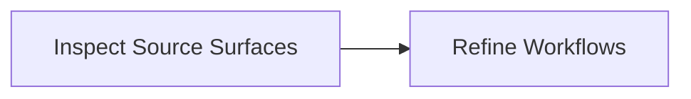

# srg-linux-paths / security Subsystem System Review Graph

Generated: `2026-06-08T20:12:02+00:00`
Scope: Generated starter subsystem map for security in /private/tmp/srg-linux-paths.
One line: Starter manifest generated from repository language, build, docs, and test surfaces.
Depth: `overview`

## Bigger Picture

This is an inferred starter map. It detects language and project surfaces, then asks maintainers or agents to refine actual workflows, gates, and boundaries.

## Current Truth

- `atlas_parent`: `srg-linux-paths`
- `detected_languages`: `["c_cpp"]`
- `file_limit`: `6000`
- `files_seen`: `308`
- `runtime_behavior_proven`: `false`
- `scanner`: `language_neutral_starter`
- `subsystem_path`: `security`

## Source Links

| Source | Notes |
|---|---|
| [Linux kernel repository](https://github.com/torvalds/linux) | Public source repository used for the path-tree stress test. |
| [Linux kernel commit 2d3090a](https://github.com/torvalds/linux/commit/2d3090a8aeb596a26935db0955d46c9a5db5c6ce) | Merge tag 'v7.1-p5' of git://git.kernel.org/pub/scm/linux/kernel/git/herbert/crypto-2.6 |

## Lifecycle Map



## Expansion Index

| Level | Use It To Answer | Report Section |
|---|---|---|
| 0. Situation | What is true now? | Current Truth |
| 0.5. Atlas | Which child map should I open next? | Map Of Maps |
| 1. Flow | How does the system move end to end? | Lifecycle Map |
| 2. Ownership | Which subsystem owns which artifact? | Artifact And Schema Map |
| 3. Control | Which rules advance, wait, or block? | Gate Map |
| 4. Implementation | Which files, APIs, docs, or outputs should I inspect? | System Details |
| 5. Audit | What should an external reviewer ask next? | Review Questions |

This is an overview report. Rebuild with `--depth standard` or `--depth deep` to expand artifacts, gates, schemas, workflows, and per-system drill-downs.

## Systems

| System | Owner | Stack | Architecture | Lifecycle | Boundary | Ideal Target |
|---|---|---|---|---|---|---|
| C / C++ Surface | unknown | C, C++ | detected source surface | source files -> build/test docs -> inferred system role | Detected from repository files; runtime behavior is not proven. | Replace this starter node with exact subsystem ownership and workflows. |

## Architecture Patterns

### Mixed-language repository

- Works for: C, C++, Java, C#, Python, JavaScript/TypeScript, Go, Rust, and mixed repos
- How to map it: Detect language/build/test/doc surfaces first, then refine into exact systems and workflows.
- What to redact: Publish paths and contracts, not private records or secrets.

## Walkthroughs

### From scan to real system review

Run scan, inspect detected surfaces, replace broad language nodes with real subsystems, then add workflows and gates.

```json
{
  "refine": [
    "systems",
    "artifacts",
    "workflows",
    "decision_gates"
  ],
  "scan": "system-review-graph scan --repo . --out system_review_manifest.json"
}
```

## Review Questions

- Which detected language surfaces are real subsystems?
- Which directories are generated or vendor noise?
- Where are APIs, CLIs, configs, migrations, docs, and tests?
- Which workflows move data or decisions end to end?
- Which gates block unsafe or unreviewed behavior?

## Rebuild Recipe

### scan

- Goal: Generate a starter manifest from repository surfaces.

```bash
system-review-graph scan --repo . --out system_review_manifest.json
```

## Known Boundaries

- Scanner output is inferred from file paths and markers.
- Runtime behavior, production deployment, and ownership are not proven.
- Maintainers or agents should refine workflows, gates, and boundaries before audit use.
- Generated from Linux path metadata only; use the public source commit before making technical claims.
