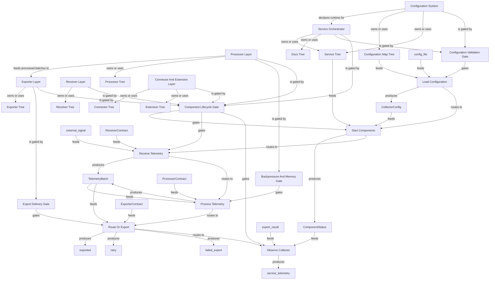

# OpenTelemetry Collector Public Repo System Review Graph

Generated: `2026-06-08T19:26:52+00:00`
Scope: A public-safe system map of the OpenTelemetry Collector open-source repository based on public source directories and documentation.
One line: The OpenTelemetry Collector routes telemetry through configurable receivers, processors, connectors, extensions, and exporters.

## Bigger Picture

This example shows how to map a component pipeline repo. The system is a configurable telemetry service: configuration declares pipelines, receivers ingest signals, processors transform or batch them, connectors can bridge pipelines, exporters send telemetry onward, extensions add service capabilities, and service orchestration manages startup, shutdown, and observability.

## Current Truth

- `example_type`: `actual_public_repo`
- `repo`: `open-telemetry/opentelemetry-collector`
- `source_accessed_at`: `2026-06-08`
- `private_database_required`: `false`
- `production_data_required`: `false`
- `official_maintainer_audit`: `false`

## Source Links

| Source | Notes |
|---|---|
| [GitHub repository](https://github.com/open-telemetry/opentelemetry-collector) | Primary public source used for repo identity and source paths. |
| [OpenTelemetry Collector documentation](https://opentelemetry.io/docs/collector/) | Public docs for collector concepts and configuration. |
| [OpenTelemetry project](https://opentelemetry.io/) | Public project context for telemetry standards. |

## Lifecycle Map

```mermaid
flowchart LR
  load_configuration["Load Configuration"]
  start_components["Start Components"]
  receive_telemetry["Receive Telemetry"]
  process_telemetry["Process Telemetry"]
  route_or_export["Route Or Export"]
  observe_collector["Observe Collector"]
  load_configuration --> start_components["Start Components"]
  start_components --> receive_telemetry["Receive Telemetry"]
  receive_telemetry --> process_telemetry["Process Telemetry"]
  process_telemetry --> route_or_export["Route Or Export"]
  route_or_export --> observe_collector["Observe Collector"]
```



## Relationship Graph



## Systems

| System | Owner | Stack | Architecture | Lifecycle | Boundary | Ideal Target |
|---|---|---|---|---|---|---|
| Configuration System | collector | Go, YAML | configuration and provider layer | config file/provider -> CollectorConfig -> pipeline graph | Configuration describes desired telemetry flow; startup gates decide whether it can run. | Every pipeline is explicit, valid, and inspectable before startup. |
| Receiver Layer | collector | Go | component ingest layer | external telemetry -> receiver -> pipeline | A receiver only starts when configuration and lifecycle checks pass. | Telemetry ingress is explicit and observable. |
| Processor Layer | collector | Go | pipeline transformation layer | TelemetryBatch -> processor chain -> TelemetryBatch | Processor behavior is bounded by pipeline order and configuration. | Transformations are predictable, measurable, and resource-aware. |
| Connector And Extension Layer | collector | Go | component extension layer | component config -> started connector/extension -> runtime capability | Connectors and extensions can change topology or service behavior; they must start cleanly. | Optional capabilities are explicit and health-reporting. |
| Exporter Layer | collector | Go | component egress layer | TelemetryBatch -> exporter -> destination | Delivery depends on destination, queue, retry, and failure policy. | Export behavior is reliable, backpressure-aware, and observable. |
| Service Orchestrator | collector | Go | service runtime | valid config -> start components -> run pipelines -> shutdown | The service can expose health and telemetry, but configured components determine data path. | A running collector is explainable from config to component status. |

## System Details

### Configuration System

- Purpose: Loads and resolves collector configuration into service pipelines.
- Code surfaces: `confmap/`, `service/`
- Artifacts: `confmap_tree`, `service_tree`
- Decision gates: `config_validation_gate`
- Boundary: Configuration describes desired telemetry flow; startup gates decide whether it can run.
- Ideal target: Every pipeline is explicit, valid, and inspectable before startup.

### Receiver Layer

- Purpose: Accepts telemetry from external sources and injects it into pipelines.
- Code surfaces: `receiver/`
- Artifacts: `receiver_tree`
- Decision gates: `component_lifecycle_gate`
- Boundary: A receiver only starts when configuration and lifecycle checks pass.
- Ideal target: Telemetry ingress is explicit and observable.

### Processor Layer

- Purpose: Transforms, batches, limits, or filters telemetry before export.
- Code surfaces: `processor/`
- Artifacts: `processor_tree`
- Decision gates: `backpressure_gate`, `component_lifecycle_gate`
- Boundary: Processor behavior is bounded by pipeline order and configuration.
- Ideal target: Transformations are predictable, measurable, and resource-aware.

### Connector And Extension Layer

- Purpose: Bridges pipelines and adds service-level capabilities.
- Code surfaces: `connector/`, `extension/`
- Artifacts: `connector_tree`, `extension_tree`
- Decision gates: `component_lifecycle_gate`
- Boundary: Connectors and extensions can change topology or service behavior; they must start cleanly.
- Ideal target: Optional capabilities are explicit and health-reporting.

### Exporter Layer

- Purpose: Sends processed telemetry to configured destinations.
- Code surfaces: `exporter/`
- Artifacts: `exporter_tree`
- Decision gates: `export_delivery_gate`, `component_lifecycle_gate`
- Boundary: Delivery depends on destination, queue, retry, and failure policy.
- Ideal target: Export behavior is reliable, backpressure-aware, and observable.

### Service Orchestrator

- Purpose: Coordinates component lifecycle, pipelines, host capabilities, and service telemetry.
- Code surfaces: `service/`, `component/`
- Artifacts: `service_tree`, `docs_tree`
- Decision gates: `config_validation_gate`, `component_lifecycle_gate`
- Boundary: The service can expose health and telemetry, but configured components determine data path.
- Ideal target: A running collector is explainable from config to component status.

## Artifacts

| Artifact | Kind | Schema | Owner | Path | Redaction | Purpose |
|---|---|---|---|---|---|---|
| Receiver Tree | source_directory | ReceiverContract | collector | receiver/ | safe_to_share | Defines receiver interfaces, helpers, and built-in receiver components. |
| Processor Tree | source_directory | ProcessorContract | collector | processor/ | safe_to_share | Defines processors that transform, batch, limit, or otherwise mediate telemetry. |
| Exporter Tree | source_directory | ExporterContract | collector | exporter/ | safe_to_share | Defines exporters and exporter helper behavior. |
| Connector Tree | source_directory | TelemetryBatch | collector | connector/ | safe_to_share | Defines connectors that can route telemetry between pipelines. |
| Extension Tree | source_directory | ComponentStatus | collector | extension/ | safe_to_share | Defines service extensions such as auth, zpages, memory limiters, and capabilities. |
| Service Tree | source_directory | CollectorConfig | collector | service/ | safe_to_share | Coordinates configuration, pipelines, component lifecycle, telemetry, and host capabilities. |
| Configuration Map Tree | source_directory | CollectorConfig | collector | confmap/ | safe_to_share | Loads and resolves configuration maps and providers. |
| Docs Tree | public_docs | CollectorConfig | docs | docs/ | safe_to_share | Documents collector behavior, proposals, and images. |

## Schemas And Contracts

| Name | Kind | Required Fields | Privacy Notes | Purpose |
|---|---|---|---|---|
| CollectorConfig | configuration_contract | receivers, processors, exporters, service.pipelines |  | Declares which components exist and how telemetry flows through pipelines. |
| ReceiverContract | component_contract | component_id, signal_type, endpoint, start_status |  | Describes an ingest component that accepts telemetry. |
| ProcessorContract | component_contract | component_id, signal_type, transform_policy, failure_policy |  | Describes transformation, batching, filtering, memory, or enrichment behavior. |
| ExporterContract | component_contract | component_id, destination, retry_policy, queue_policy |  | Describes where telemetry is sent and how failures are handled. |
| TelemetryBatch | data_contract | signal_type, resource_attrs, scope, records |  | Represents telemetry moving through a pipeline. |
| ComponentStatus | health_contract | component_id, status, error, observed_at |  | Represents component lifecycle and health state. |

## Decision Gates

### Configuration Validation Gate

- Inputs: `CollectorConfig`
- Outputs: `valid_config, config_error`
- Human gate: `false`
- Risk boundary: The collector should not start an invalid pipeline.

| If | Then |
|---|---|
| all referenced components exist and pipeline shape is valid | valid_config |
| missing component, invalid signal type, or bad setting | config_error |

### Component Lifecycle Gate

- Inputs: `ReceiverContract, ProcessorContract, ExporterContract, ComponentStatus`
- Outputs: `component_started, component_failed`
- Human gate: `false`
- Risk boundary: Telemetry should flow only after required components start successfully.

| If | Then |
|---|---|
| component starts and reports healthy | component_started |
| component fails startup or dependency check | component_failed |

### Backpressure And Memory Gate

- Inputs: `TelemetryBatch, ComponentStatus`
- Outputs: `accept_batch, drop_or_throttle`
- Human gate: `false`
- Risk boundary: A collector should protect host resources under load.

| If | Then |
|---|---|
| resource limits allow processing | accept_batch |
| queue or memory policy triggers | drop_or_throttle |

### Export Delivery Gate

- Inputs: `TelemetryBatch, ExporterContract`
- Outputs: `exported, retry, failed_export`
- Human gate: `false`
- Risk boundary: Telemetry delivery failures should follow retry and queue policy.

| If | Then |
|---|---|
| destination accepts batch | exported |
| temporary failure and retry policy allows | retry |
| permanent failure or queue exhausted | failed_export |

## Workflows

| Step | Actor | Consumes | Gates | Produces | Next | Purpose |
|---|---|---|---|---|---|---|
| Load Configuration | Configuration System | config_file, confmap_tree | config_validation_gate | CollectorConfig | start_components | Resolve component and pipeline configuration. |
| Start Components | Service Orchestrator | CollectorConfig, service_tree | component_lifecycle_gate | ComponentStatus | receive_telemetry | Start receivers, processors, exporters, connectors, and extensions. |
| Receive Telemetry | Receiver Layer | external_signal, ReceiverContract | component_lifecycle_gate | TelemetryBatch | process_telemetry | Bring traces, metrics, or logs into a configured pipeline. |
| Process Telemetry | Processor Layer | TelemetryBatch, ProcessorContract | backpressure_gate | TelemetryBatch | route_or_export | Apply configured processing and protect host resources. |
| Route Or Export | Connector And Exporter Layers | TelemetryBatch, ExporterContract | export_delivery_gate | exported, retry, failed_export | observe_collector | Send telemetry onward or route it through another pipeline. |
| Observe Collector | Service Orchestrator | ComponentStatus, export_result | component_lifecycle_gate | service_telemetry |  | Expose service status and runtime telemetry for operators. |

## Architecture Patterns

### Component pipeline

- Works for: Telemetry agents, ETL jobs, event routers, streaming processors, and plugin frameworks
- How to map it: Map config, components, pipeline topology, lifecycle gates, backpressure gates, and delivery gates.
- What to redact: Expose component names and contracts; redact customer endpoints, secrets, and payload content.

### Enterprise API-only review

- Works for: Platforms where reviewers cannot access databases or deployed services
- How to map it: Use public component contracts, fake config, health states, and delivery-policy examples.
- What to redact: Do not publish production telemetry, endpoint URLs, tokens, tenant names, or incident traces.

## Walkthroughs

### One telemetry batch through a pipeline

A config declares a pipeline. The service starts components. A receiver accepts telemetry, processors transform or batch it, connectors can route it, and exporters deliver it with retry and queue policies.

```json
{
  "gates": [
    "config_validation_gate",
    "component_lifecycle_gate",
    "backpressure_gate",
    "export_delivery_gate"
  ],
  "path": [
    "CollectorConfig",
    "ReceiverContract",
    "TelemetryBatch",
    "ProcessorContract",
    "ExporterContract"
  ],
  "signals": [
    "traces",
    "metrics",
    "logs"
  ]
}
```

### How to audit without customer telemetry

A reviewer can use fake config and public component contracts to understand topology, gates, and failure handling without seeing production payloads.

```json
{
  "requires_customer_payloads": false,
  "safe_artifacts": [
    "receiver/",
    "processor/",
    "exporter/",
    "connector/",
    "extension/",
    "service/",
    "confmap/"
  ]
}
```

## Review Questions

- How does configuration become a running telemetry pipeline?
- Which gates prevent invalid config or failed components from processing telemetry?
- Where are backpressure, memory, queue, retry, and delivery policies enforced?
- How can a reviewer audit topology without seeing customer telemetry payloads?
- Which component health and service telemetry artifacts would prove runtime behavior?

## Rebuild Recipe

### validate

- Goal: Check the OpenTelemetry Collector public repo manifest.

```bash
system-review-graph validate --manifest examples/actual_repos/opentelemetry_collector/system_review_manifest.json
```

### build

- Goal: Generate the OpenTelemetry Collector system review report.

```bash
system-review-graph build --manifest examples/actual_repos/opentelemetry_collector/system_review_manifest.json --out-dir examples/actual_repos/opentelemetry_collector/reports
```

## Known Boundaries

- This is a public educational map, not an official OpenTelemetry maintainer audit.
- It maps the collector architecture at a high level, not every component or distribution.
- Real enterprise reviews should use fake or redacted telemetry payloads.
- A full audit should inspect exact config, component versions, tests, runtime metrics, and deployment policy.
