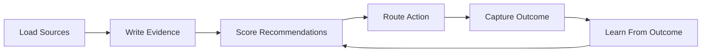
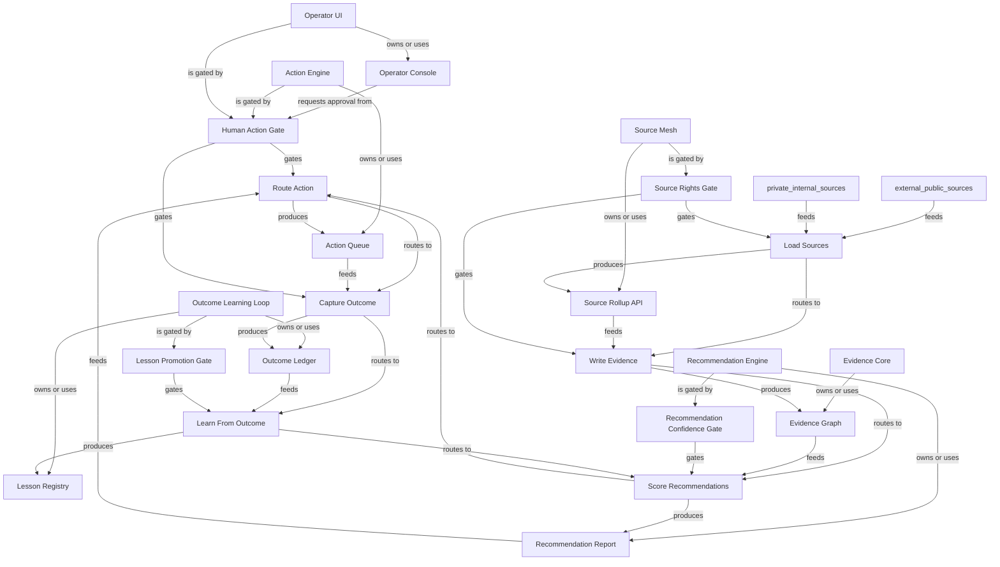

# Fictional AI Ops System Review Graph

Generated: `2026-06-08T19:26:51+00:00`
Scope: A fictional public-safe AI operations system used as an open-source example.
One line: Code-review graph shows the files; this system-review graph shows how evidence becomes recommended action, outcome, and lesson.

## Bigger Picture

This example shows how a team can explain a complex system without exposing private databases. The system collects safe source summaries, stores evidence contracts, recommends actions, blocks risky operations behind human review, captures outcomes, and turns lessons into better rules.

## Current Truth

- `recommendations_today`: `12`
- `actions_allowed_without_human`: `4`
- `actions_requiring_human_review`: `8`
- `unsafe_action_bypass_count`: `0`
- `outcomes_pending_capture`: `3`
- `production_database_exposed`: `false`

## Lifecycle Map



## Relationship Graph



## Systems

| System | Owner | Stack | Architecture | Lifecycle | Boundary | Ideal Target |
|---|---|---|---|---|---|---|
| Source Mesh | data-platform | Python, TypeScript | loader mesh | source -> SourceEnvelope -> source rights gate | Source summaries are not product claims. | Every source has freshness, rights, and retry metadata. |
| Evidence Core | data-platform | PostgreSQL, Python | private evidence graph | SourceEnvelope -> EvidenceFact -> graph neighborhood | Database remains private; public report exposes only schema and examples. | Every recommendation can trace back to facts and sources. |
| Recommendation Engine | intelligence | Python | batch plus API scoring | EvidenceFact -> RecommendationCard -> confidence gate | A recommendation is not an executed action. | Every recommendation has evidence, confidence, failure modes, and next action. |
| Action Engine | operations | Python, Redis | event-driven workflow | RecommendationCard -> ActionIntent -> human gate | Restricted actions require approval before execution. | Every action intent has an outcome slot. |
| Outcome Learning Loop | research | Python | ledger and validation loop | ActionIntent -> OutcomeRecord -> LessonRecord -> promotion gate | A lesson does not change future behavior until promotion is validated. | Knowledge becomes wisdom through observed outcomes. |
| Operator UI | operations | TypeScript, React | report-backed control room | reports -> UI -> operator decision -> action intent | UI reads canonical reports and requests actions; it does not invent truth. | Operator can run the day from one evidence-backed control room. |

## System Details

### Source Mesh

- Purpose: Collects sanitized source summaries from internal and public systems.
- Code surfaces: `loaders/`, `services/source_rollups`
- Artifacts: `source_rollup_api`
- Decision gates: `source_rights_gate`
- Boundary: Source summaries are not product claims.
- Ideal target: Every source has freshness, rights, and retry metadata.

### Evidence Core

- Purpose: Stores facts, relationships, and reasoning traces used by recommendations.
- Code surfaces: `db/migrations`, `services/evidence`
- Artifacts: `evidence_graph`
- Decision gates: `none`
- Boundary: Database remains private; public report exposes only schema and examples.
- Ideal target: Every recommendation can trace back to facts and sources.

### Recommendation Engine

- Purpose: Turns evidence into reviewable recommendation cards.
- Code surfaces: `engine/recommendations`
- Artifacts: `recommendation_report`
- Decision gates: `recommendation_confidence_gate`
- Boundary: A recommendation is not an executed action.
- Ideal target: Every recommendation has evidence, confidence, failure modes, and next action.

### Action Engine

- Purpose: Routes approved recommendations into bounded action intents.
- Code surfaces: `workers/action_engine`
- Artifacts: `action_queue`
- Decision gates: `human_action_gate`
- Boundary: Restricted actions require approval before execution.
- Ideal target: Every action intent has an outcome slot.

### Outcome Learning Loop

- Purpose: Captures what happened and converts outcomes into lessons.
- Code surfaces: `workers/outcomes`, `workers/lessons`
- Artifacts: `outcome_ledger`, `lesson_registry`
- Decision gates: `lesson_promotion_gate`
- Boundary: A lesson does not change future behavior until promotion is validated.
- Ideal target: Knowledge becomes wisdom through observed outcomes.

### Operator UI

- Purpose: Shows recommendations, approvals, outcomes, and lessons without owning truth.
- Code surfaces: `apps/operator`
- Artifacts: `operator_console`
- Decision gates: `human_action_gate`
- Boundary: UI reads canonical reports and requests actions; it does not invent truth.
- Ideal target: Operator can run the day from one evidence-backed control room.

## Artifacts

| Artifact | Kind | Schema | Owner | Path | Redaction | Purpose |
|---|---|---|---|---|---|---|
| Source Rollup API | api | SourceEnvelope | data-platform | GET /internal/source-rollups | public_summary_only | Returns sanitized source summaries. |
| Evidence Graph | private_database | EvidenceFact | data-platform | private://evidence_graph | schema_only | Canonical internal evidence store. |
| Recommendation Report | json_report | RecommendationCard | intelligence | reports/recommendations.json | safe_to_share | Reviewable recommendation cards. |
| Action Queue | queue | ActionIntent | operations | queue://action-intents | counts_only | Downstream actions waiting for execution or review. |
| Outcome Ledger | jsonl_ledger | OutcomeRecord | operations | reports/outcomes.jsonl | safe_to_share | Reality feedback from executed or skipped actions. |
| Lesson Registry | jsonl_ledger | LessonRecord | research | reports/lessons.jsonl | safe_to_share | Validated lessons and parked rule changes. |
| Operator Console | ui | ActionIntent | operations | app://operator | public_summary_only | Shows recommendations, blockers, approvals, outcomes, and lessons. |

## Schemas And Contracts

| Name | Kind | Required Fields | Privacy Notes | Purpose |
|---|---|---|---|---|
| SourceEnvelope | sanitized_event | source_id, observed_at, source_type, summary, rights_status | Raw source bodies and credentials are never included. | Describes a source observation without exposing raw vendor payloads. |
| EvidenceFact | graph_fact | fact_id, subject, kind, payload, valid_at, source_ref | Payload should be redacted or fake in public examples. | Stores traceable evidence used by recommendations. |
| RecommendationCard | decision_input | recommendation_id, subject, confidence, reason, evidence_refs, risk_level |  | Explains why the system recommends an action. |
| ActionIntent | downstream_action | action_id, recommendation_id, action_type, human_gate_required, status |  | Represents a proposed action before execution. |
| OutcomeRecord | reality_feedback | outcome_id, action_id, capture_status, result, evidence_refs |  | Captures whether action created the intended result. |
| LessonRecord | learning_loop | lesson_id, outcome_id, lesson, rule_change_status |  | Turns outcomes into validated or parked rule changes. |

## Decision Gates

### Source Rights Gate

- Inputs: `SourceEnvelope.rights_status`
- Outputs: `internal_only, safe_to_use, blocked`
- Human gate: `false`
- Risk boundary: No downstream product or public claim uses a source unless rights are clear.

| If | Then |
|---|---|
| rights_status == blocked | blocked |
| rights_status == internal_review | internal_only |
| rights_status == approved | safe_to_use |

### Recommendation Confidence Gate

- Inputs: `RecommendationCard.confidence, RecommendationCard.evidence_refs`
- Outputs: `advance, wait, reject`
- Human gate: `false`
- Risk boundary: Weak or ungrounded recommendations cannot become action intents.

| If | Then |
|---|---|
| confidence >= 0.75 and evidence_refs present | advance |
| confidence >= 0.5 | wait |
| missing evidence | reject |

### Human Action Gate

- Inputs: `ActionIntent.action_type, RecommendationCard.risk_level`
- Outputs: `approved, blocked, needs_review`
- Human gate: `true`
- Risk boundary: External sends, money movement, deletion, legal claims, and user-visible changes need approval.

| If | Then |
|---|---|
| risk_level == high | needs_review |
| action_type in external_send, deletion, money_movement | needs_review |
| approval missing for restricted action | blocked |

### Lesson Promotion Gate

- Inputs: `OutcomeRecord.result, LessonRecord.rule_change_status`
- Outputs: `promote, park, kill`
- Human gate: `false`
- Risk boundary: One good outcome is not enough to change future system behavior.

| If | Then |
|---|---|
| repeated positive outcomes and validation pass | promote |
| evidence incomplete | park |
| negative or unsafe outcome | kill |

## Workflows

| Step | Actor | Consumes | Gates | Produces | Next | Purpose |
|---|---|---|---|---|---|---|
| Load Sources | Source Mesh | external_public_sources, private_internal_sources | source_rights_gate | source_rollup_api | write_evidence | Create sanitized source summaries. |
| Write Evidence | Evidence Core | source_rollup_api | source_rights_gate | evidence_graph | score_recommendations | Persist traceable facts without exposing private records. |
| Score Recommendations | Recommendation Engine | evidence_graph | recommendation_confidence_gate | recommendation_report | route_action | Generate reviewable recommendation cards. |
| Route Action | Action Engine | recommendation_report | human_action_gate | action_queue | capture_outcome | Create bounded action intents. |
| Capture Outcome | Outcome Worker | action_queue | human_action_gate | outcome_ledger | learn_from_outcome | Record what happened after action or no-action. |
| Learn From Outcome | Research Worker | outcome_ledger | lesson_promotion_gate | lesson_registry | score_recommendations | Improve or reject future rules. |

## Architecture Patterns

### Open-source library

- Works for: Python, JavaScript, Rust, Go, Java, or mixed-language libraries
- How to map it: Map public APIs as artifacts, type contracts as schemas, CI/release checks as gates, and examples as walkthroughs.
- What to redact: Usually safe to share full paths and examples.

### Private enterprise microservice

- Works for: Teams that cannot expose databases or production internals
- How to map it: Map services, APIs, queues, and sanitized contracts. Use logical names for private infrastructure.
- What to redact: Publish schema-only or counts-only artifacts for sensitive stores.

### Data platform

- Works for: Warehouses, data lakes, ELT/ETL pipelines, reporting systems
- How to map it: Map source loaders, quality checks, marts, dashboards, rights/freshness gates, and report outputs.
- What to redact: Expose table contracts and quality counts, not raw records.

### AI or agent system

- Works for: LLM apps, agent swarms, RAG systems, ML workflows
- How to map it: Map tools, memory, prompts, retrieval artifacts, eval gates, human approvals, and outcome loops.
- What to redact: Remove secrets, user content, private prompts, and production traces.

### Embedded or microarchitecture-style system

- Works for: Firmware, hardware interfaces, compiler/runtime internals, chips, robotics
- How to map it: Map interface contracts, telemetry, safety thresholds, state machines, and fault gates.
- What to redact: Publish logical interfaces and safety boundaries, not proprietary layouts or confidential specs.

## Walkthroughs

### From source to action

A source rollup says billing-delay tickets increased. The evidence graph stores a redacted fact. The recommendation engine creates a card. The action engine proposes customer communication. The human action gate requires approval because this is external communication.

```json
{
  "fact": "billing delay mentions increased",
  "gate": "human_action_gate",
  "recommendation": "prepare customer update",
  "result": "needs_review",
  "source": "support_summary"
}
```

### From outcome to lesson

An approved action produces a positive outcome. The lesson loop records that early customer communication reduced repeat tickets. The lesson is parked until repeated validation proves the rule should be promoted.

```json
{
  "lesson": "early communication may reduce repeat tickets",
  "outcome": "repeat tickets down 18%",
  "promotion": "park_until_repeated"
}
```

### Private database review

The database is never exposed. Reviewers see the EvidenceFact contract, redaction policy, source counts, and decision gates. They can understand behavior without seeing private rows.

```json
{
  "database": "private://evidence_graph",
  "public_view": "schema_only",
  "reviewable": [
    "contract",
    "gate",
    "artifact purpose",
    "redaction policy"
  ]
}
```

## Review Questions

- Which source and evidence artifacts prove each recommendation?
- Which decision gate blocks unsafe downstream action?
- Which actions require human approval and why?
- Where is the outcome captured after action or no-action?
- Which lessons are promoted, parked, or killed based on reality feedback?
- What can be safely reviewed if the production database remains private?

## Rebuild Recipe

### validate

- Goal: Check the manifest shape.

```bash
system-review-graph validate --manifest examples/fictional_ai_ops/system_review_manifest.json
```

### build

- Goal: Generate JSON and Markdown reports.

```bash
system-review-graph build --manifest examples/fictional_ai_ops/system_review_manifest.json --out-dir examples/fictional_ai_ops/reports
```

### review

- Goal: Read the system as an operating map.

```bash
open examples/fictional_ai_ops/reports/system_review_graph.md
```

## Known Boundaries

- This report explains architecture and system behavior; it does not prove production correctness.
- Sanitized examples must not be treated as real data.
- A passing gate in a report still needs implementation tests in the actual system.
- Human/legal/security gates should be implemented in production code, not only documented.
